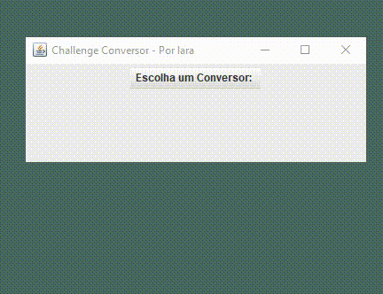

# Conversor de Moeda e Temperatura - Programa ONE Oracle + Alura

# Índice 

* [Descrição do Projeto](#descrição-do-projeto)
* [Status do Projeto](#status-do-projeto)
* [Funcionalidades](#funcionalidades)
* [Demonstração da Aplicação](#demonstração-da-aplicação)
* [Tecnologias utilizadas](#tecnologias-utilizadas)

# Descrição do projeto

Criação de um conversor de moeda utilizando a linguagem Java. As características solicitadas por nosso cliente são as seguintes:
- Converter de Reais a Dólar
- Converter de Reais a Euro
- Converter de Reais a Libras Esterlinas
- Converter de Reais a Peso Argentino
- Converter de Reais a Peso Chileno
  
Lembrando que deve ser possível também converter de forma inversa. E como desafio extra, foi proposto adicionar outro tipo de conversor, como o de temperaturas.

# Status do projeto

# Funcionalidades

- Conversão de moedas;
- Conversão de temperaturas (ºC <--> ºF).

# Demonstração da Aplicação

# Tecnologias utilizadas

- Java
- Eclipse IDE

<h4> :pen: Iara Varjão - Julho/2023</h4>
